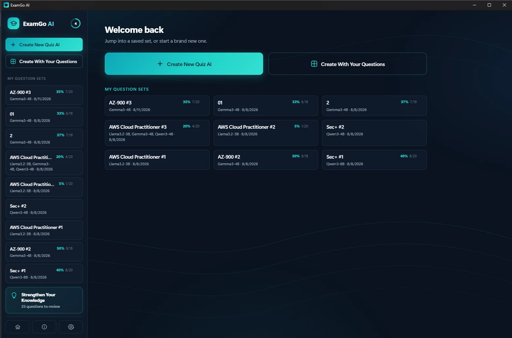
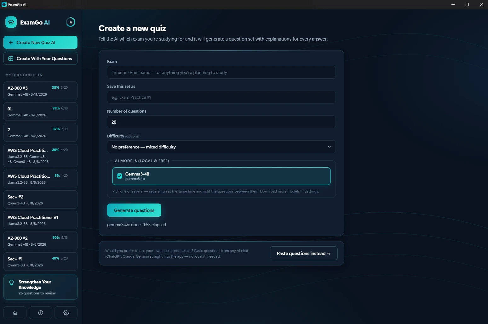
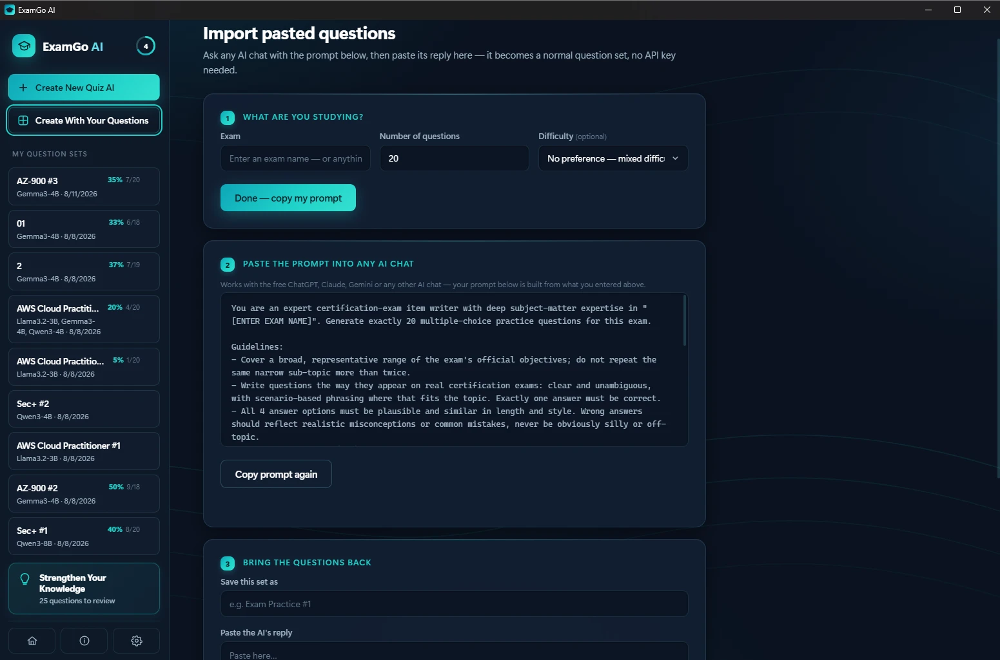
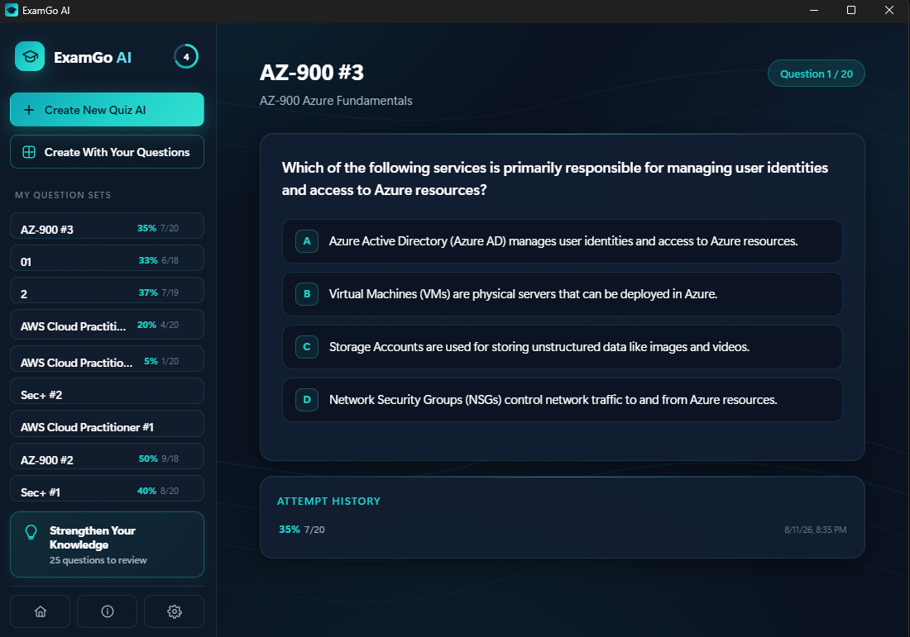
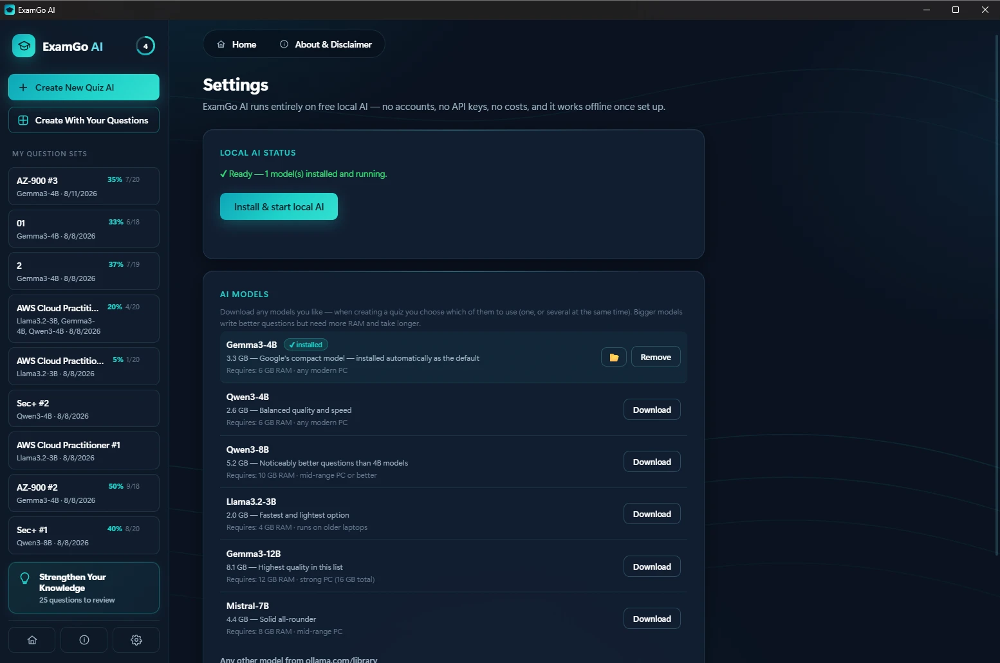

# ExamGo AI

A free desktop app for generating and practicing certification-exam quizzes with AI — entirely on your own PC, no accounts, no API keys, no ongoing costs.



## Features

- **Local AI generation** — powered by [Ollama](https://ollama.com), running completely offline after a one-time setup. Pick from Gemma, Qwen, Llama, or Mistral models, or run several at once and split the question count between them.
- **Automatic setup** — on first launch, ExamGo AI installs Ollama and downloads a starter model for you. No terminal, no manual configuration.
- **Bring your own questions** — no local AI needed: paste questions generated by any free AI chat (ChatGPT, Claude, Gemini) using the built-in prompt, and they're imported straight into a normal question set.
- **Difficulty control** — optionally target Easy, Medium, or Hard questions, or leave it mixed.
- **Instant feedback** — right/wrong on every answer, with an explanation for all four options so you learn from mistakes, not just correct guesses.
- **Attempt history** — every quiz retake is tracked, with score history per set.
- **Strengthen Your Knowledge** — every question you've ever gotten wrong, across every set, is pooled into one persistent review list. Nothing disappears just because you got it right once — you control what comes off the list, either by dismissing a single question or resetting the whole list.
- **Everything local** — question sets, scores, and downloaded AI models are stored entirely on your PC. Nothing is sent to a server, aside from the one-time Ollama/model downloads during setup.
- **Windows & macOS** — native installers for both.

## Screenshots

| | |
|---|---|
|  Create a quiz with local AI, choosing exam, difficulty, and one or more models |  Or paste questions from any AI chat — no local AI required |
|  Every wrong answer, from every set, pooled into one review list |  Manage local AI models — download, remove, or add more |

## Installing

Download the latest installer for your platform from the [Releases](../../releases) page and run it. That's it — Ollama and a starter AI model are set up automatically the first time you open the app.

## Building from source

Requires [Rust](https://rustup.rs), [Node.js](https://nodejs.org), and the [Tauri prerequisites](https://tauri.app/start/prerequisites/) for your platform.

```bash
npm install
npm run tauri dev    # run in development mode
npm run tauri build  # produce a release installer
```

## License

ExamGo AI is released under the [MIT License](LICENSE).

Ollama and each AI model it can download carry their own separate licenses — see **About & Disclaimer** inside the app for details.

## Disclaimer

Questions and explanations are AI-generated and may be incomplete or incorrect. This is practice material, not official exam content, and always verify against official study guides. ExamGo AI is not affiliated with or endorsed by any certification provider. See **About & Disclaimer** in the app for the full text.
